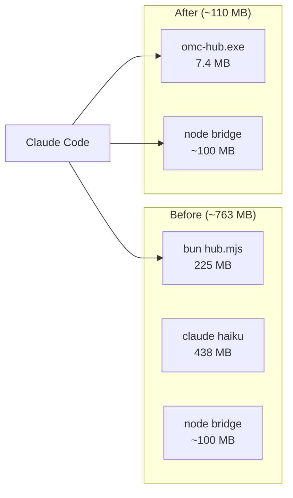
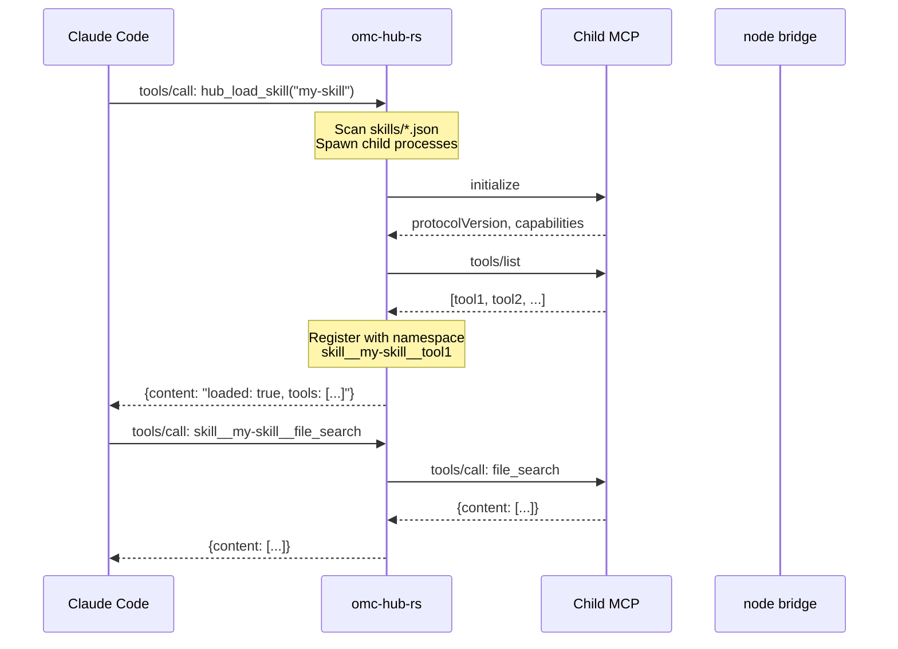
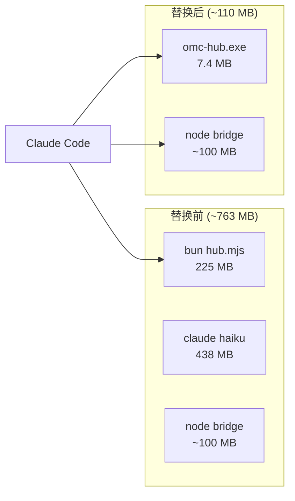

# omc-hub-rs

<!-- Badges -->
[](https://github.com/2233admin/omc-hub-rs/releases)
[](LICENSE)
[](https://github.com/2233admin/omc-hub-rs/actions)
[](https://www.rust-lang.org)
[](https://github.com/2233admin/omc-hub-rs/releases)

[English](#english) | [中文](#中文)

---

<a id="english"></a>

## TL;DR

**Lightweight MCP hub for Claude Code.** Drop-in replacement for [oh-my-claudecode](https://github.com/Yeachan-Heo/oh-my-claudecode)'s MCP backend — a **2.5MB Rust binary** replacing **763MB** of bun + haiku subprocess overhead.

| Before | After |
|--------|-------|
| `node hub.mjs` — 84.5 MB | `omc-hub.exe` — **7.4 MB** |
| Total: ~763 MB | Total: ~110 MB |
| | **86% less memory** |

## The Problem

OMC's MCP infrastructure runs **three processes** just to provide tools to Claude Code:

```
bun (hub.mjs)           225 MB   MCP tool multiplexer (454 lines of JS)
claude.exe --model haiku 438 MB   Full LLM subprocess for "skill matching"
node (bridge)            ~100 MB   33 tools (state, notepad, LSP, etc.)
────────────────────────────────
Total                   ~763 MB   For JSON forwarding + file I/O + keyword lookup
```

The haiku subprocess uses a **full Claude instance** (438MB) to match user input against ~50 keywords. That's a HashMap lookup.

## The Solution



### Memory Benchmark

Measured on Windows 11 (Ryzen 9800X3D), idle after startup:

| Process | Working Set (RSS) | Reduction |
|---------|-------------------|-----------|
| `node hub.mjs` (OMC default) | **84.5 MB** | — |
| `omc-hub.exe` (this project) | **7.4 MB** | **11.4x** |

```powershell
# Reproduce
$n = Start-Process node -ArgumentList "$env:USERPROFILE/.omc/mcp-hub/hub.mjs" -PassThru -WindowStyle Hidden
Start-Sleep 4; (Get-Process -Id $n.Id).WorkingSet64 / 1MB
Stop-Process -Id $n.Id -Force

$r = Start-Process "omc-hub.exe" -PassThru -WindowStyle Hidden
Start-Sleep 4; (Get-Process -Id $r.Id).WorkingSet64 / 1MB
Stop-Process -Id $r.Id -Force
```

## Features

### 26 Built-in Tools

| Category | Tools | Count |
|----------|-------|-------|
| Hub Management | load_skill, unload_skill, list_skills, reload_toolbox, stats | 5 |
| Toolbox | Script execution (bash/python/node) | 1+ |
| State | read, write, clear, list_active, get_status | 5 |
| Notepad | read, write_priority, write_working, write_manual, prune, stats | 6 |
| Project Memory | read, write, add_note, add_directive | 4 |
| Trace | timeline, summary | 2 |
| Session | search | 1 |
| AST | ast_grep_search, ast_grep_replace (via sg CLI) | 2 |

### Architecture



## Quick Start

### 1. Download

```bash
# Windows
gh release download --repo 2233admin/omc-hub-rs --pattern '*windows*'

# macOS (Apple Silicon)
gh release download --repo 2233admin/omc-hub-rs --pattern '*macos-aarch64*'

# Linux
gh release download --repo 2233admin/omc-hub-rs --pattern '*linux-x86_64*'
```

Or [download from Releases](https://github.com/2233admin/omc-hub-rs/releases).

### 2. Build from Source

```bash
git clone https://github.com/2233admin/omc-hub-rs.git
cd omc-hub-rs
cargo build --release
# Binary: target/release/omc-hub (.exe on Windows)
```

### 3. Configure

Add to `~/.claude/settings.json`:

```json
{
  "mcpServers": {
    "omc-mcp-hub": {
      "command": "/path/to/omc-hub",
      "args": ["--config", "~/.omc/mcp-hub"]
    }
  }
}
```

The `--config` path points to your existing OMC mcp-hub directory (containing `skills/` and `toolbox/`). This coexists with OMC's node bridge — no need to disable anything.

## OMC Update Compatibility

**omc-hub-rs survives OMC updates.**

| Location | Key | Updated by |
|----------|-----|------------|
| `settings.json` | `"omc-mcp-hub"` | omc-hub-rs |
| Plugin `.mcp.json` | `"t"` | `omc update` |

`omc update` only touches the plugin directory, never `settings.json`. Both servers run in parallel — 20 tools overlap harmlessly, LSP stays in node.

## Verified

| Test | Result |
|------|--------|
| MCP initialize handshake | PASS |
| tools/list (26 tools) | PASS |
| hub_list_skills (6 skill configs) | PASS |
| hub_stats | PASS |
| Toolbox script execution | PASS |
| state_list_active | PASS |
| notepad_stats | PASS |
| project_memory_read | PASS |
| Skill load error handling | PASS |
| ping / heartbeat | PASS |
| Unknown method error (-32601) | PASS |
| Memory 7.4 MB runtime (measured) | PASS |
| Binary < 3MB | PASS |

## Documentation

- [DEVELOPMENT.md](DEVELOPMENT.md) — Developer guide, architecture, testing
- [CONTRIBUTING.md](CONTRIBUTING.md) — Contribution guidelines

## Related

- [cli2skill](https://github.com/2233admin/cli2skill) — Convert any CLI or MCP server into an Agent Skill (zero process overhead)
- [OMC Issue #1878](https://github.com/Yeachan-Heo/oh-my-claudecode/issues/1878) — Memory overhead report with benchmark data

## License

MIT

---

<a id="中文"></a>

# omc-hub-rs (中文)

## 简介

Claude Code 的轻量级 MCP hub。替换 [oh-my-claudecode](https://github.com/Yeachan-Heo/oh-my-claudecode) 的 MCP 后端 — 用 **2.5MB Rust 二进制**替掉 **763MB** 的 bun + haiku 子进程。

| 替换前 | 替换后 |
|--------|--------|
| `node hub.mjs` — 84.5 MB | `omc-hub.exe` — **7.4 MB** |
| 总计: ~763 MB | 总计: ~110 MB |
| | **节省 86% 内存** |

## 问题

OMC 的 MCP 基础设施跑了**三个进程**：

```
bun (hub.mjs)            225 MB   MCP 工具多路复用器（454 行 JS）
claude.exe --model haiku  438 MB   完整的 LLM 子进程做"skill 匹配"
node (bridge)            ~100 MB   33 个工具（state, notepad, LSP 等）
────────────────────────────────────
总计                     ~763 MB   就为了 JSON 转发 + 文件读写 + 关键词查找
```

haiku 子进程用了一个**完整的 Claude 实例**（438MB）来匹配 ~50 个关键词。这他妈是 HashMap 就能做的事。

## 解决方案



### 内存基准测试

在 Windows 11 (Ryzen 9800X3D) 上测量，空闲启动后：

| 进程 | 工作集 (RSS) | 降低 |
|------|-------------|------|
| `node hub.mjs` (OMC 默认) | **84.5 MB** | — |
| `omc-hub.exe` (本项目) | **7.4 MB** | **11.4 倍** |

## 功能

### 包含 26 个工具

| 类别 | 工具 | 数量 |
|------|------|------|
| Hub 管理 | load/unload/list/reload/stats | 5 |
| 工具箱 | 脚本执行 (bash/python/node) | 1+ |
| State 状态 | read/write/clear/list_active/get_status | 5 |
| Notepad 记事本 | read/write_priority/write_working/write_manual/prune/stats | 6 |
| 项目记忆 | read/write/add_note/add_directive | 4 |
| Trace 追踪 | timeline/summary | 2 |
| Session 搜索 | search | 1 |
| AST 语法树 | ast_grep_search/replace (通过 sg CLI) | 2 |

## 快速开始

### 1. 下载

```bash
# Windows
gh release download --repo 2233admin/omc-hub-rs --pattern '*windows*'

# macOS (Apple Silicon)
gh release download --repo 2233admin/omc-hub-rs --pattern '*macos-aarch64*'

# Linux
gh release download --repo 2233admin/omc-hub-rs --pattern '*linux-x86_64*'
```

或[从 Releases 页面下载](https://github.com/2233admin/omc-hub-rs/releases)。

### 2. 从源码构建

```bash
git clone https://github.com/2233admin/omc-hub-rs.git
cd omc-hub-rs
cargo build --release
# 二进制: target/release/omc-hub (.exe on Windows)
```

### 3. 配置

在 `~/.claude/settings.json` 加入：

```json
{
  "mcpServers": {
    "omc-mcp-hub": {
      "command": "/path/to/omc-hub",
      "args": ["--config", "~/.omc/mcp-hub"]
    }
  }
}
```

`--config` 路径指向你现有的 OMC mcp-hub 目录（包含 `skills/` 和 `toolbox/`）。这与 OMC 的 node bridge 共存，无需禁用任何东西。

## OMC 更新兼容

**omc-hub-rs 不受 OMC 更新影响。**

| 位置 | Key | 由谁更新 |
|------|-----|---------|
| `settings.json` | `"omc-mcp-hub"` | omc-hub-rs |
| 插件 `.mcp.json` | `"t"` | `omc update` |

`omc update` 只碰插件目录，不碰 settings.json。两个服务器并行运行 — 20 个工具重叠无害，LSP 留在 node 里。

## 验证通过

| 测试 | 结果 |
|------|------|
| MCP initialize 握手 | PASS |
| tools/list (26 工具) | PASS |
| hub_list_skills (6 skill 配置) | PASS |
| hub_stats | PASS |
| Toolbox 脚本执行 | PASS |
| state_list_active | PASS |
| notepad_stats | PASS |
| project_memory_read | PASS |
| Skill 加载错误处理 | PASS |
| ping / 心跳 | PASS |
| 未知方法错误 (-32601) | PASS |
| 内存 7.4 MB 运行时 (实测) | PASS |
| 二进制 < 3MB | PASS |

## 文档

- [DEVELOPMENT.md](DEVELOPMENT.md) — 开发者指南, 架构, 测试
- [CONTRIBUTING.md](CONTRIBUTING.md) — 贡献指南

## 相关项目

- [cli2skill](https://github.com/2233admin/cli2skill) — 把任何 CLI 或 MCP server 转成 Agent Skill（零进程开销）
- [OMC Issue #1878](https://github.com/Yeachan-Heo/oh-my-claudecode/issues/1878) — 内存占用报告 + benchmark 数据

## 许可证

MIT
